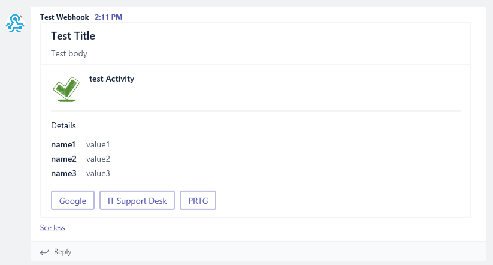
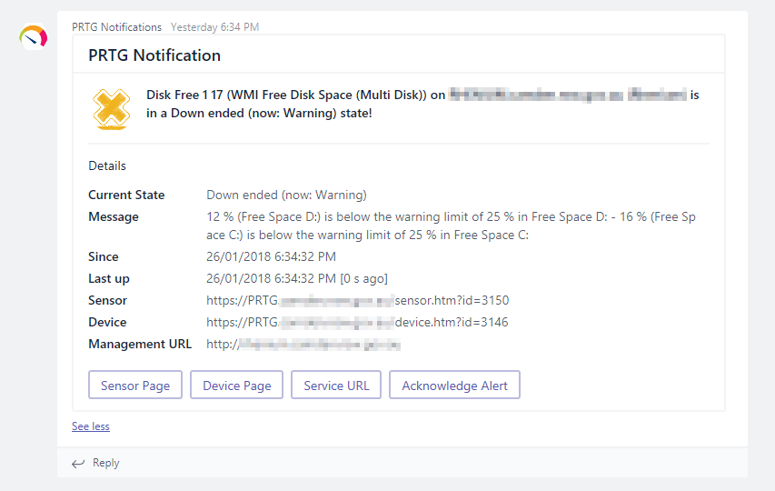
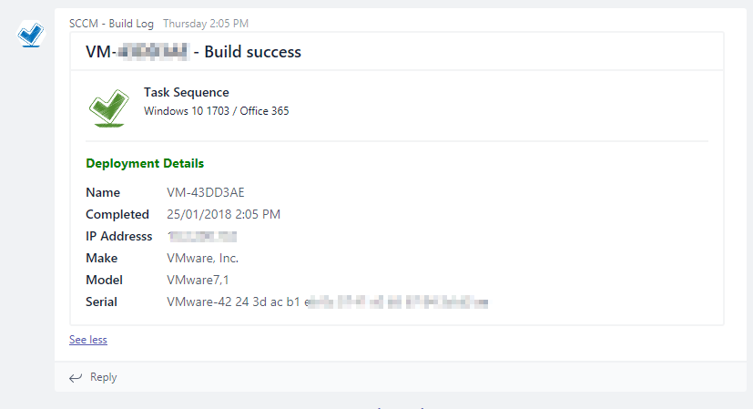

# PSMicrosoftTeams

Powershell module for sending rich messages to Microsoft Teams through channel webhooks

## Getting Started

For basic operation simply clone or download the module to your local machine or module repo.


### Prerequisites

This module has a required parameter for the URI which is created when adding a webhook to a Microsoft Teams channel.

To enable a webhook on a channel:

1. Open Microsoft Teams
2. Create a new channel or select and existing
3. Press the three dots '...' to open the settings
4. Select 'Connectors'
5. Once the screen loads, select 'Incoming Webhook' by pressing 'Configure'
6. Enter a name and upload and image (if required)

When you select 'Create' the next screen will show a 'URI', make sure you save this somewhere for later use in your script

## Installing

### Powershell

Add the module files to you module path and use:

```
Import-Module PSMicrosoftTeams
```

### Images
The script will use BASE64 encoded images located in the 'IMAGES' folder. You can replace these with your own images if you want to match a particular corporate style.

The images must be .JPG format and should be kept as small as possible to avoid timeouts when uploading to teams. 

## Usage

To send an MS Teams notification from a script use the following format:

```
Send-TeamChannelMessage -messageType Information -messageTitle "Test Title" -messageBody "Test body" -activityTitle "test Activity" -URI "INSERT YOUR WEBHOOK URI HERE" -details @(@{ name = 'name1'; value = 'value1' }, @{ name = 'name2'; value = 'value2' }, @{ name = 'name3'; value = 'value3' }) -buttons @(@{ name = 'Google'; value = 'https://www.google.com' }, @{ name = 'IT Support Desk'; value = 'https://itsupportdesk.com' }, @{ name = 'PRTG'; value = 'https://prtg.com' })
```

See the module for a full parameter explanation.

## Examples

### Default Example



### PRTG Notification Example



### SCCM OSD Build Example



### Group Policy Change Example


## Contributing

https://github.com/mhouston100/PSMicrosoftTeams


## Authors

* **Matthew Houston** - *Initial work* -

See also the list of [contributors](https://github.com/mhouston100/PSMicrosoftTeams/graphs/contributors) who participated in this project.


